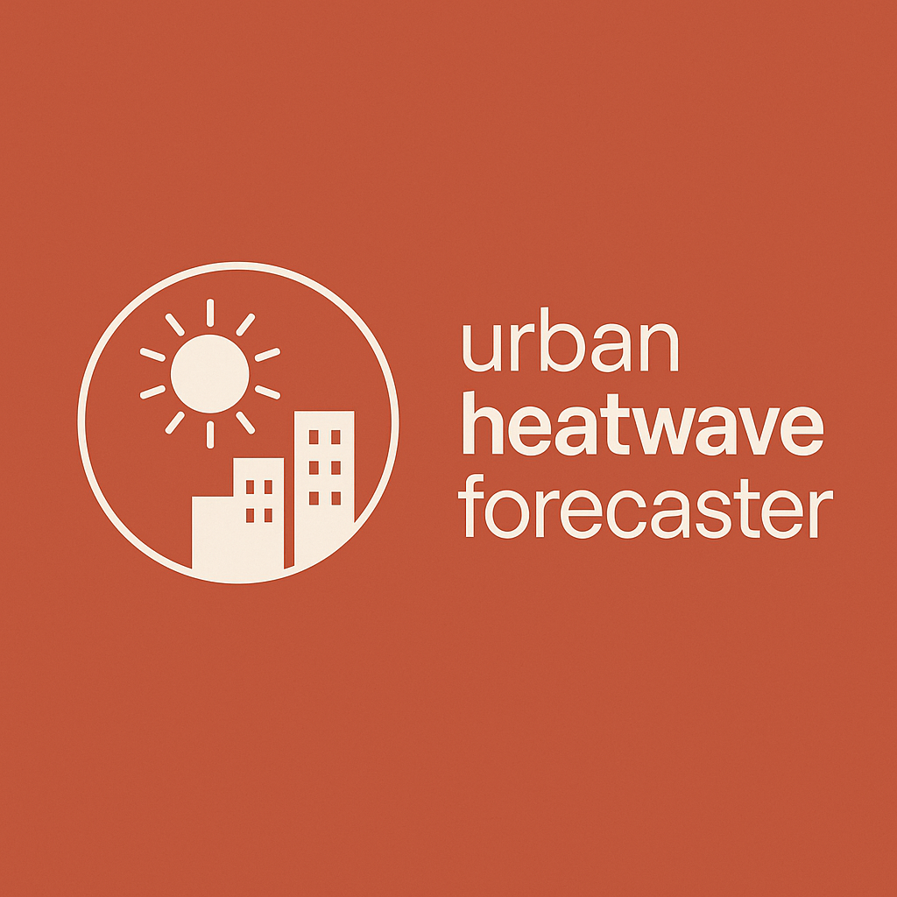

#  [Urban Heatwave Impact Forecaster](https://urban-heatwave-forecaster.streamlit.app/) – Real-time Detection & Risk Assessment


Open-source pipeline that **fetches weather data, calculates climatological normals, detects heatwaves, scores their risk, and serves everything through an interactive Streamlit dashboard**.
Built for researchers, city planners, or anyone who needs timely insight into extreme urban heat events.

---

## 🌐 Scalability & Design Philosophy

This project serves as a **foundational pipeline** for operational urban heatwave analysis. Its architecture is intentionally designed for scalability and reproducibility:

* **Spatial Scaling**: Add any city or coordinate pair via a simple YAML entry—no code changes required
* **Temporal Scaling**: Ingests decades of historical data and refreshes daily forecasts, using sliding-window processing to keep memory use constant
* **Variable Expansion**: Plug-in fetchers allow humidity, wind, or air-quality metrics to be integrated without touching the detection core
* **Deployment Flexibility**: The same codebase runs as a CLI, a scheduled cron job, or a live Streamlit Cloud app
* **Reproducible Workflows**: Pinned dependencies, deterministic algorithms, and automated tests guarantee consistent results across environments

The current public release focuses on **three pilot cities (Athens, Rome, Stockholm)** to:

1. Showcase end-to-end functionality clearly
2. Keep the initial repository lightweight for reviewers and CI pipelines
3. Provide a template that users can replicate globally with minimal configuration

---

## 🧠 Overview

1. **Fetch climate data** (historical & forecast) from ECMWF/Open-Meteo
2. **Compute 1991–2020 climate normals** for each location
3. **Detect heatwaves** using a configurable percentile & run-length algorithm
4. **Assess risk** with a severity index that blends intensity, duration, and population exposure
5. **Visualize** risk time-series and event summaries in Streamlit

---

## 📂 Project Structure

```
urban-heatwave-forecaster/
├── src/urban_heatwave_forecaster/   # Core Python package
│   ├── data_fetcher.py              # Historical & forecast retrieval
│   ├── climate_normals.py           # Baseline climatology
│   ├── detect_heatwaves.py          # Event detection logic
│   ├── risk_model.py                # Severity scoring
│   └── __init__.py
├── app.py                           # Streamlit front-end
├── data/                            # Raw & interim data (git-ignored)
├── outputs/                         # Results & figures (git-ignored)
├── requirements.txt                 # Runtime deps for Streamlit Cloud
├── pyproject.toml                   # Package & pinned deps
├── .gitignore
└── README.md
```

---

## 🚀 Getting Started

### 1 Clone the repo

```bash
git clone https://github.com/mikegiannopoulos/urban-heatwave-forecaster.git
cd urban-heatwave-forecaster
```

### 2 Create & activate a virtual environment

```bash
python -m venv .venv
source .venv/bin/activate    # Windows: .venv\Scripts\activate
```

### 3 Install the package

```bash
pip install -e .
```

### 4 Run a quick test

```bash
python -m urban_heatwave_forecaster.cli fetch --city Athens
python -m urban_heatwave_forecaster.cli detect --city Athens
python -m urban_heatwave_forecaster.cli assess --city Athens
```

### 5 Launch the dashboard

```bash
streamlit run app.py
```

---

## ➕ Adding a New City

To analyze a new location, add its name and coordinates to a config file like `config/cities.yaml` (or wherever your project expects them), e.g.:

```yaml
athens:
  lat: 37.9838
  lon: 23.7275
rome:
  lat: 41.9028
  lon: 12.4964
stockholm:
  lat: 59.3293
  lon: 18.0686
```

Then run the pipeline:

```bash
python -m urban_heatwave_forecaster.cli fetch --city stockholm
```

---

## 🛠 Algorithms & Models

* **Heatwave detection:** 95th-percentile threshold above climatology for ≥ 3 consecutive days (configurable)
* **Risk index:** weighted sum of Tmax anomaly, event duration, and urban population density (see `risk_model.py`)
* **Caching:** `@st.cache_data` in Streamlit and on-disk Parquet files keep repeated runs fast

---


## 📜 License

GNU Affero General Public License v3.0 (AGPL-3.0) © 2025 Michael Giannopoulos & Contributors
This project is free to use, modify, and share under the terms of the AGPLv3.
**Commercial use is prohibited unless the source code of derivative works is also made public.**


---

## Acknowledgments

* **Forecast**: [ECMWF IFS 0.25° model via Open-Meteo](https://open-meteo.com/)
* **Historical Normals**: [ECMWF IFS model 1991–2020 reanalysis](https://open-meteo.com/en/docs/historical-weather-api)
* **Population & Green Space Data**: [Urban Dataset – Husqvarna HUGSI](https://hugsi.green/cities/index)

---

## Author

*Created and maintained by Michael Giannopoulos — climate scientist|data analyst.*
